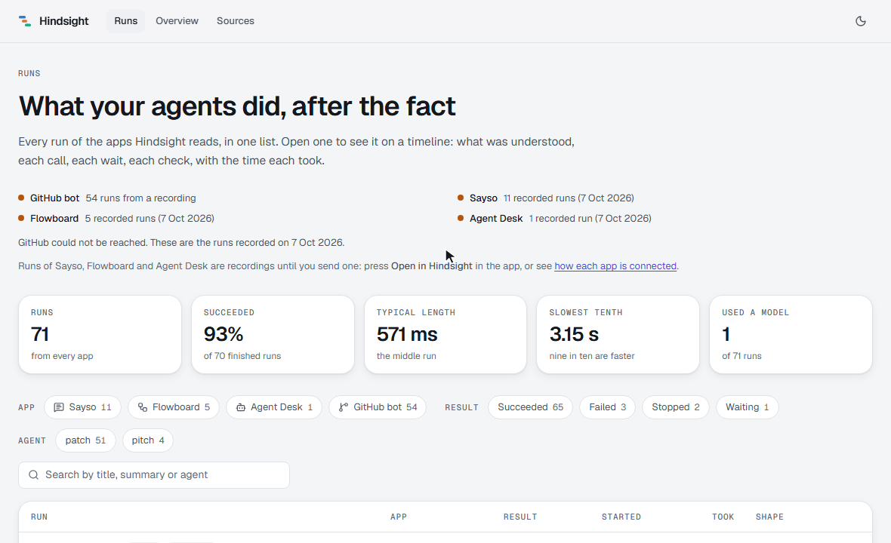
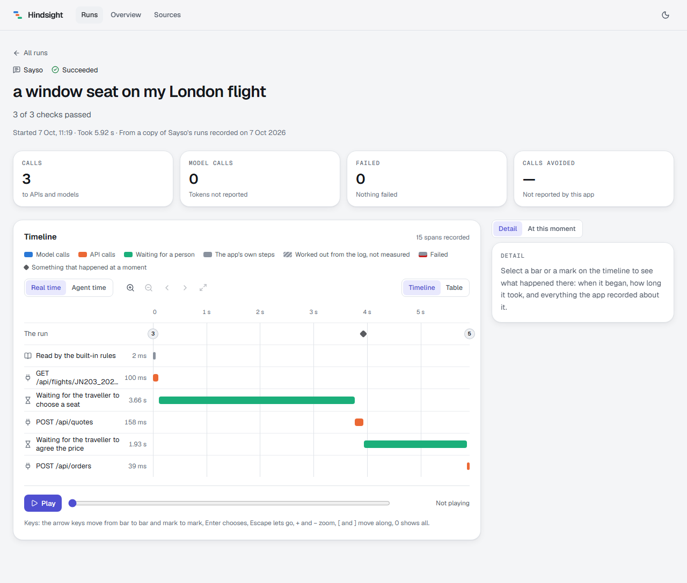
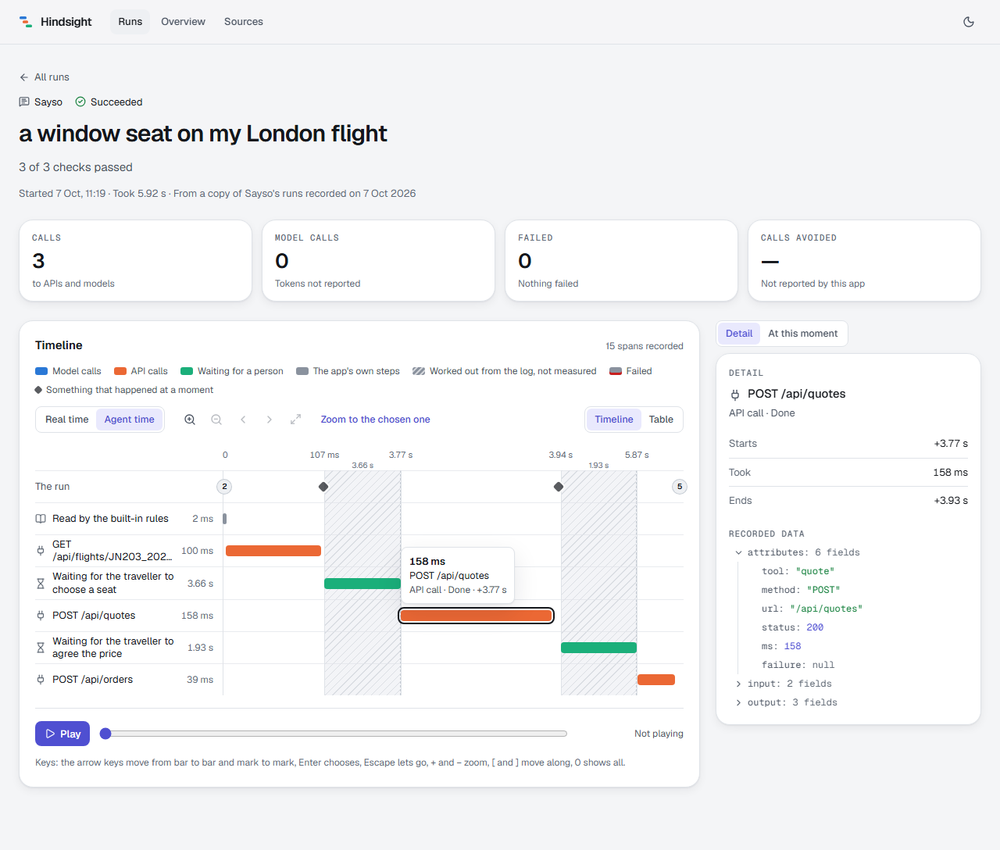
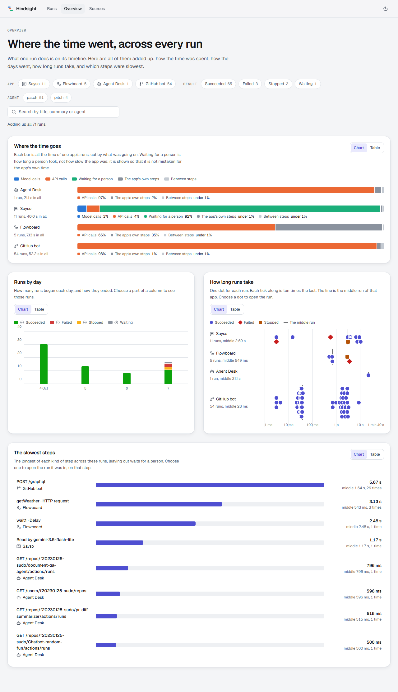
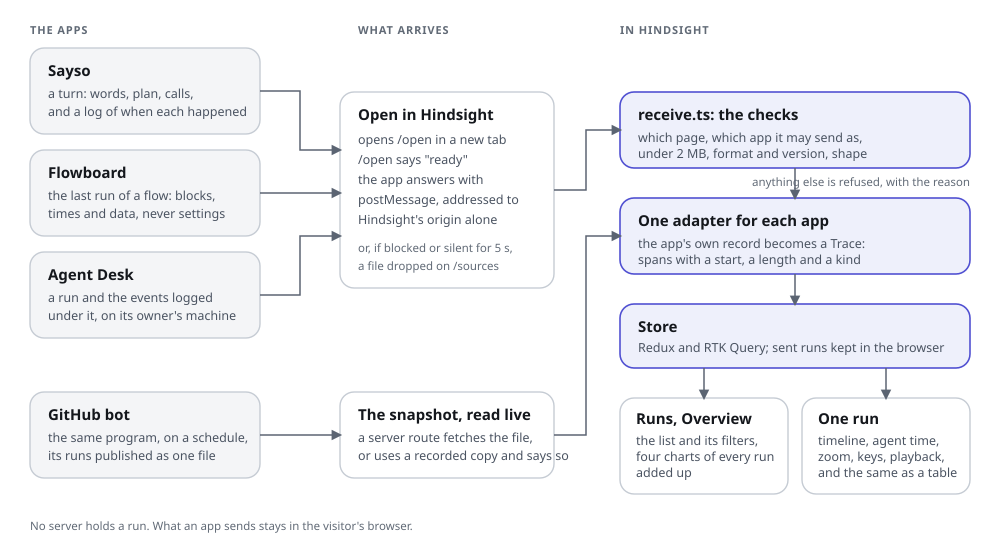

# Hindsight

**What your agents did, after the fact.** Hindsight reads the runs of four apps and lays each one out on a timeline: what was understood, every call, every wait, every check, with the time each took. It is a small version of an agent observer: one place to look when an agent did something and you want to know how.

**Live: https://hindsight-sand.vercel.app**



The four apps it reads, all mine: [Sayso](https://github.com/f20230125-sudo/sayso) (a desk where a typed request is answered with working interface), [Flowboard](https://github.com/f20230125-sudo/flowboard) (a visual workflow builder), and [Agent Desk and its GitHub bot](https://github.com/f20230125-sudo/github-bot) (two agents that look after a GitHub and a LinkedIn presence).

## What it shows

**One run, as a timeline.** One bar for each stretch of work, indented under the step that held it; things that happened at a moment are small marks. Blue is a model call, orange an API call, green waiting for a person, grey the app's own steps. A failed bar has a red underline and an icon; a bar whose times were worked out from the log, not measured, is striped, and the panel says why.

| Real time | Agent time |
|---|---|
|  |  |

The run above is a real Sayso journey: a traveller chooses a window seat and pays. The traveller took 3.66 s to choose and 1.93 s to agree the price, between calls that took 100, 158 and 39 ms. In real time the calls are invisible. **Agent time** squeezes each wait for a person to a share of the work around it and marks the break with its real length, so what the app did fills the picture.

You can zoom and move along a run, play it back (a panel says what was going on at that moment and what the person had been shown), read it as a table, and move through every bar and mark with the arrow keys. The clock, the zoom and the chosen span are in the address, so any view of a run is a link.

**All the runs, added up.**



Where the time goes, for each app (cut so that nothing is counted twice: a ten-second step holding a nine-second call is nine seconds of call). Runs by day and how they ended, where each part of a column opens exactly those runs. How long runs take, a dot for each run on a scale where each step is ten times the last. The slowest steps, by what they were. Each chart has a table view, a tooltip on hover and on focus, and a legend, and the filters that scope them live in the address.

**The list.** Every run of every app, newest first, filterable by app, result, agent and text, with the figures for what is shown. A run that is a recording says so beside its name, so a recording is never taken for a run that just happened.

## Four apps, one format



Each app keeps its runs its own way. An **adapter** in `src/sources` turns a run into one shape, a `Trace`, and nothing outside `src/sources` knows where a trace came from. The format is a Zod schema in `src/trace/schema.ts`; the types are worked out from it, and the same schema checks anything that arrives from outside. A trace is a list of spans. Each has a kind (`understand`, `plan`, `step`, `tool`, `model`, `wait`, `check`, `said`), a start and a length from the beginning of the run, a status, whether its times were `measured` or `estimated`, the line the person was shown (if any), and the data the app recorded.

| App | How its runs get here | Until one is sent |
|---|---|---|
| GitHub bot | Read live from the file its scheduled job commits to GitHub | A recorded copy, if GitHub cannot be reached |
| Sayso | An **Open in Hindsight** button in its "How it worked" panel | 11 real runs recorded by driving the app in a browser |
| Flowboard | An **Open in Hindsight** button in its Run panel | 5 real runs recorded the same way |
| Agent Desk | An **Open in Hindsight** button on a run's page | 1 real audit from its backend, with GitHub answering for real |

### Sending a run, with no server

The button opens Hindsight's `/open` page in a new tab. That page tells the tab that opened it that it is ready (a message with nothing in it). The app answers with the run, addressed to Hindsight's origin alone, so no other page can read it. Hindsight keeps it in the browser and opens it. If the tab is blocked, or says nothing for five seconds, the app saves the run as a file, which can be dropped on the Sources page. Nothing is uploaded.

Everything that arrives is checked, in `src/sources/receive.ts`:

- it must come from the app's own page (a fixed list of addresses), and a page may send only as its own app;
- it is read only from the tab that opened Hindsight's page, and anything else is ignored without a word;
- it must be under 2 MB, say it is in the `hindsight/run` format, version 1, and fit the shape that app is known to write, or it is refused with the reason, in plain words;
- a message is written out as JSON and read back before anything looks at it, so what is checked and kept is what a file would have held, and data nested deeper than 64 levels is refused before anything walks it.

A run's text is only ever drawn as text. Nothing from a run is put into a link or into the page as markup, and a test sends a run whose every field is markup and a script address and checks that nothing runs. As a second fence, every page is sent with a Content-Security-Policy that names no other site (no script, style, font or image from elsewhere, and no request to anywhere but Hindsight's own server), and with headers that stop another site from showing Hindsight in a frame. The policy still allows inline scripts, because Next.js writes them into each page and doing without would mean no page could be built ahead of time; that is said in `next.config.ts` and under Limits.

What each app sends is its own record of one run: Sayso, a turn with its plan, calls and a log of what happened and when; Flowboard, the blocks' names and kinds and the data that passed through them, **never their settings**, which can hold keys; Agent Desk, a run and its events. Adding an app means writing one adapter and adding its address to the list.

## What the real data showed

Building the adapters against real runs, not made-up ones, turned up things a made-up run would not have.

- **A call can be logged after its run began.** The GitHub bot's scheduled job logs each call when it ends, with how long it took, so a call began that long before its stamp. In 48 of the 78 calls in the recorded runs, that is before the run's first event. Drawing them at their true length would put them before the start of the run, so each is cut at the start, marked as estimated, and the panel says how long the call really took and how much of it falls before the run was recorded. Nothing is stretched to make the picture tidy. (Agent Desk's own runs, logged as they happen, have none.)
- **25 of the bot's 78 GitHub requests were refused with `403`.** The cause is in the bot's own code: the token a scheduled GitHub Actions job is given cannot list a user's repositories through `/user/repos`, so the bot is refused and asks for the public list instead. It remembers a refusal only for the length of one process, and the job starts a new process for every run, so it asks, and is refused, on every scheduled audit. The run succeeds, so nothing in its log says it failed. Hindsight shows each refusal as a failed call inside a run that succeeded, which is what an observer is for.
- **In the recorded Sayso journeys, 92% of the time was the traveller deciding.** The bot's runs are 98% API calls. Neither shows in real time on a single run, and both show in the overview.
- **The demo session in Agent Desk's fixtures was not used.** Its events are 120 ms apart for calls recorded at about 400 ms, because that is replay pacing, so a timeline built from it would be invented. The Agent Desk sample is a real audit by its backend instead.

## Decisions

- **The format is the contract.** Pages read traces, adapters write them, and an adapter is a plain function tested against real data copied from its app.
- **Colour means kind of time, and nothing else.** Three kinds of time are worth telling apart at a glance (model, API call, waiting for a person), and take the first three hues of a palette checked for colour-blind separation against both themes' surfaces. Everything else the app does is grey, because it is not an identity. Failures and estimates are not colours: a failed bar has a red underline and an icon, an estimated one has stripes. The status colours of the overview come with an icon and a word.
- **A wait for a person is not the app being slow.** It gets its own colour, it is squeezed in agent time, it is a separate part of every bar in the overview, and it is left out of the slowest steps.
- **No chart library.** React draws the timeline and the charts, so they follow the theme, work with the keyboard, and each bar is a real button or link. `d3-scale` is used only for axis arithmetic.
- **Runs sent here stay in the browser.** The server has no database, and a run is saved the moment the page is left, not only after a short wait.
- **Nothing costs money.** No model, no key, no paid service.

## Checks

- 289 unit tests, against real runs where there are real runs: the adapters, the receiver, the time scale and its inverse, playback, the way time is counted without counting twice, the view state, the statistics, the store.
- 98 end-to-end tests in a real browser: every page, the hand-over from a stand-in for each app's page (including a page that is not allowed, and an app sending as another), the file drop, the keyboard, playback, the security headers and a run made of markup, and axe accessibility scans of every page in both themes and at phone width.
- CI runs lint, the type check, the unit tests, the build and the end-to-end tests; builds the Docker image, starts it and asks it for its pages; and applies `deploy/k8s.yaml` to a real cluster (kind) and checks both pods come up under the manifest's security settings.
- The end-to-end tests found two real faults while this was built: a run saved 250 ms after it arrived was lost if the page was reloaded inside that wait (it is now saved when the page is left), and a link inside running text that was told apart only by colour (it is underlined).
- A review after it was built, reading each adapter beside the app it reads, found more that the tests had passed over, each now fixed with a test:
  - **Playing a run in agent time could fail to finish.** The time at the end of the track is worked out from the squeezed widths, and for about one made-up run in twenty with a wait in it, it came back a hair short of the run's length (45918.99999999999 for 45919), so the playhead never arrived. The two ends of the track are now exact, and playback ends by its place on the track.
  - **A Sayso call that failed with no answer borrowed the next try's details.** Sayso keeps a record of a call only when an answer came back. With no connection there is none, so the failed try was drawn with the method, address, status 200 and length of the try that worked after it.
  - **Zooming in agent time zoomed about the wrong middle.** It was worked out in milliseconds, and the middle of a run in milliseconds is often inside a wait that agent time has squeezed to a sliver. It is now worked out along the track.
  - **With the track zoomed in, the arrow keys stopped on rows with nothing on show,** and when the first row was one of those the timeline had no place in the tab order at all.
  - Smaller ones: a Flowboard block left out because the block before it was left out was placed at the start of the run, not at that moment; a Sayso turn kept before its log existed showed no calls; a long message in an Agent Desk run would have had the whole run refused; a run dated years from the rest made the by-day chart count every day between; and the validation library tried `eval` on every page, which the new policy refused and the browser reported.

## Run it

```
npm install
npm run dev        # http://localhost:3040
```

| Command | What it does |
|---|---|
| `npm run lint` | ESLint |
| `npm run typecheck` | Next's route types, then `tsc` |
| `npm test` | Vitest |
| `npm run build` then `CI=1 npm run e2e` | Playwright against the production build |
| `npm run screenshots`, `npm run gif` | Retake the pictures in this README (a production build must be running with `HINDSIGHT_SNAPSHOT_URL` pointed at nothing, so it uses the recorded runs) |
| `node scripts/record-apps.mjs [sayso\|flowboard]` | Drives the running apps in a browser, presses their button, and saves what they hand over to `src/samples` |
| `node scripts/record-github-bot.mjs` | Records the bot's runs from its public snapshot |
| `node scripts/check-buttons.mjs` | Presses each app's button on the web and checks that Hindsight opens the run |
| `node scripts/look.mjs [path] [light\|dark] [width] [name]` | Opens a page in a real browser and saves a picture |

The server reads the bot's snapshot from `raw.githubusercontent.com`. If it cannot be reached, it answers with the copy recorded in `src/samples/github-bot.json` and says so on the page. The tests point the server at an address with nothing at it, so they always read the same recorded runs and never touch the network. `docker compose up --build` runs it in a container; `deploy/k8s.yaml` is a manifest for two copies behind a Service.

## Limits

- The bot's snapshot lists its newest 100 runs, and Hindsight shows all of them.
- The recordings of Sayso and Flowboard were made against stand-ins for the outside services those apps call (the weather, a ticket system, a model provider), which answered after a delay, so recording needs no keys and no network. The apps, their journeys and the times are real; the replies they got are not.
- A run sent from an app lives in the browser it was sent to. A link to it works there and nowhere else.
- Cost in money and confidence scores are not shown, because none of the four apps records either. Model calls and tokens are shown where an app reports them.
- Agent time squeezes waits for a person only. A run with none looks the same in both clocks.
- Playback is not a replay of the screen the person saw, but of what was said to them and what was going on. In real time it goes at the speed the run did, except that a run takes no less than four seconds and no more than twelve to play; in agent time it crosses the track at an even pace.
- The Content-Security-Policy allows inline scripts and styles, so it limits where a page can load from and send to, but would not by itself stop markup that reached the page from running. What stops that is that a run's text is never drawn as markup.
